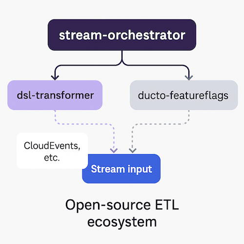

<!--suppress HtmlDeprecatedAttribute -->
<p align="right">
    <a href="https://github.com/tommed" title="See Project Ducto">
        
    </a>
</p>

# Ducto DSL

[](https://github.com/tommed/ducto-dsl/actions/workflows/ci.yml)
[](https://codecov.io/gh/tommed/ducto-dsl)

---

## About

<p align="center">
  
</p>

`dsl-transformer` is a lightweight, embeddable data transformation engine designed for structured data (JSON, maps, structs). Transformations are defined using a DSL (JSON or HCL-based), making it suitable for use cases like:

- Event stream manipulation
- API response mutation
- ETL pipelines
- Testing tools and CLI automation

It is:
- ⚡ Minimal
- 🟣 Composable
- 🟩 Fully testable

`dsl-transformer` is a part of the larger [Ducto project](https://github.com/tommed), combining many interesting practices together including Feature Flagging.



## DSL Specification

See [doc/specs.md](docs/specs.md) for a specification of the DSL.

---

## Features (WIP)
- [x] CLI for local testing
- [x] Declarative `set` and `copy` operations
- [x] Support for `map`, `delete`, `merge`
- [x] Linter included for instruction validation
- [ ] Conditionals
- [ ] Embeddable Go SDK
- [ ] Input can be JSON or YAML
- [ ] HCL-powered syntax option
- [ ] Serverless runtime compatibility
- [ ] OpenTelemetry instrumentation

Also, see our [OSS Release Checklist](./OSS_RELEASE_CHECKLIST.md).

---

## Example

### `examples/simplest.json`

```json
{
  "version": 1,
  "instructions": [
    {"op": "set", "key": "greeting", "value": "hello world"}
  ]
}
```

## Install

```bash
go install github.com/tommed/ducto-dsl/cmd/ducto-dsl@latest

# Run from a file
ducto-dsl program.json < input.json
# Or piping stdout into stdin
echo '{"foo": "bar"}' | ducto-dsl program.json

# Lint
ducto-dsl lint program.json
```

## From Source

### Lint

```bash
go run ./cmd/ducto-cli lint examples/simplest.json
```

### Run

```bash
echo '{"foo":"bar"}' | go run ./cmd/ducto-cli ./examples/simplest.json
```

#### Output:

```json
{
  "foo": "bar",
  "greeting": "hello world"
}

```

## Development

Please make sure you read our [Code of Conduct](./CODE_OF_CONDUCT.md) before engaging with this project. 

### Testing

```bash
make test         # Short tests
make test-full    # Full tests
make coverage     # Coverage report (HTML)
make lint-install # Install lint prerequisites
make lint         # Run static analysis
```

### CLI

There are [Makefile](./Makefile) targets for a macOS binary and Windows binary. Or simply build all:

```bash
make 
make build-all
```

## Status

See [status.md](docs/status.md) for up-to-date CI, coverage, and project health.
Our [OSS Release Checklist](./OSS_RELEASE_CHECKLIST.md) also provides an overview of where we are with this project.

## License

- Code is all licensed under [MIT](./LICENSE)
- The Ducto name, logos and robot illustrations (and likeness) are (C) Copyright 2025 Tom Medhurst, all rights reserved.